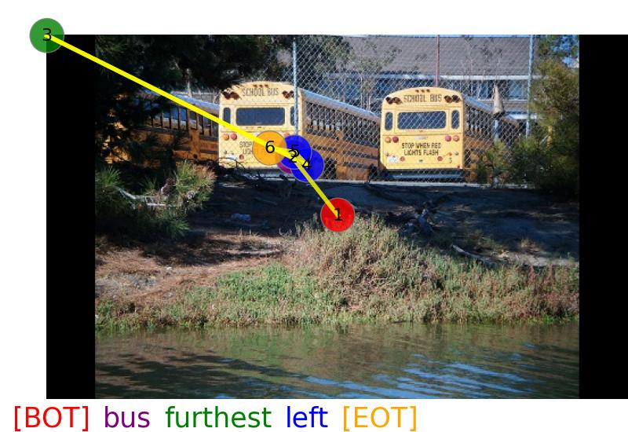

# Unified Multimodal Scanpath Prediction with Perception Enhanced Vision-Language Models
In this paper, we propose UniScanVLA, a unified scanpath prediction framework for diverse multimodal scenarios.

# Environment
和 [Sa2VA: Marrying SAM2 with LLaVA for Dense Grounded Understanding of Images and Videos](https://github.com/bytedance/Sa2VA/tree/main) 一样

或者可以通过以下命令来配置环境：
```bash
conda create -n vlm python=3.10.16
conda activate vlm
pip install -r requirements.txt
```
注意transformers的版本需要为4.57.6，其余版本不一定适配

# Files to download
### Qwen3-VL-2B
由于我们主要使用Qwen3-VL-2B来进行实验，因此首先需要通过如下huggingface链接[Qwen/Qwen3-VL-2B-Instruct](https://huggingface.co/OpenGVLab/InternVL3-2B) 获得获得Qwen3-VL-2B的模型权重

### Segmentation LoRA
[Sa2VA](https://github.com/bytedance/Sa2VA?tab=readme-ov-file)模型使用Qwen3-VL-2B来进行图像分割工作，我们需要提取他在LLM训练得到的参数作为Segmentation LoRA. 
首先需要通过如下huggingface链接[ByteDance/Sa2VA-Qwen3-VL-2B](https://huggingface.co/ByteDance/Sa2VA-Qwen3-VL-2B) 获得获得Sa2VA的模型权重（即Segmentation LoRA）

随后，需要使用[这个脚本](tools/convert_to_pth.py) 来将 [Segmentation LoRA](https://huggingface.co/Qwen/Qwen3-VL-2B-Instruct) 从huggingface 格式转移到 .pth格式（转移之后才可以用torch.load加载Segmentation LoRA）。

或者可以通过 [这个链接](https://drive.google.com/file/d/1-nzlFI-4cDkQRgbodIXguKLFb3-YEF7c/view?usp=drive_link) 来下载相应的Segmentation LoRA.

### 模型权重
可以通过如下该[链接](https://drive.google.com/drive/folders/1bIfyqbADC__bJ04W2jvsIzeTUzwV0CuN?usp=drive_link)获得我们获得模型权重（包含Object Referral, Image Caption, Object Category, VQA 四个场景）：

由于零样本目标类别导向的场景采用交叉验证的方式来进行实现，总共包含了18个模型。太多了，这部分的模型权重就不开源。注意，零样本训练的时候为了避免过拟合，我们不使用Scanpath LoRA，完全冻结VLM.

### 最终的代码框架需要像如下的结构所示
```shell
ScanVLA/

├── pretrained/ #预训练参数
│     └── model_qwen_2b.pth
│     └── checkpoints/
│     └── Qwen3-VL-2B-Instruct/
└── projects/ #模型核心代码，一个子文件夹代表一个任务
└── test_evaluation_metrics/ #测试脚本
└── tools/ #画图、格式转换
└── vlm/ #VLM相关代码
└── work_dirs/ #训练过程中产生，用于保存checkpoints等信息
└── .vscode #Debug使用时设置
└── train.py #训练入口
└── README.md
└── requirements.txt
```

# Train 
训练需要参考如下脚本启动训练：
```bash
#使用2张卡在RefCOCOGaze数据集上训练Object Referral任务
CUDA_VISIBLE_DEVICES=0,1 python -m torch.distributed.run --nnodes=1 --node_rank=0 --master_addr=127.0.0.7 --master_port=29407 --nproc_per_node=2 train.py projects/ScanVLA_RefCOCOGaze/configs/ScanVLA_RefCOCOGaze.py --launcher pytorch --deepspeed deepspeed_zero2

#使用4张卡在RefCOCOGaze数据集上训练Object Referral任务
CUDA_VISIBLE_DEVICES=0,1,3,4 python -m torch.distributed.run --nnodes=1 --node_rank=0 --master_addr=127.0.0.7 --master_port=29407 --nproc_per_node=4 train.py projects/ScanVLA_COCOSearch18/configs/ScanVLA_TP.py --launcher pytorch --deepspeed deepspeed_zero2

# 其中，CUDA_VISIBLE_DEVICES 设定需要使用的显卡，nproc_per_node为训练的显卡数量，.py文件为对应的配位文件（都在对应任务下的configs/文件夹下）

```
注意需要使用每个任务对应的配置文件，训练相关参数在配置文件中修改

四个任务中，建议最先完成Object Referral任务（RefCOCOGaze数据集），随后依次完成Object Category，Image Caption，VQA。

其中projects/ScanVLA_RefCOCOGaze_Ablation中的代码时消融实验过程中使用的代码，并没有很好维护，仅供参考。projects/ScanVLA_COCOSearch18_ZeroGaze 代表零验本情况下，代码里只给了一种类别情况，其余需要对应修改，仅供参考。不建议直接使用这两个目录下的文件


### Debug
如果你需要Debug，需要对应修改 (./vscode/launch.json)中对应的配置文件，以及使用显卡（CUDA_VISIBLE_DEVICES）。然后使用train.py来进行Debug

# Test
测试脚本在 test_evaluation_metrics 文件夹下

以下脚本分别验证了在Object Referral, Image Caption, Object Category, VQA, 以及Zero-Shot等场景下的效果。RefCOCOGaze,LN,COCOSearch18,AiR为对应的数据集名称。
```bash
python test_evaluation_metrics/test_metrics_refcocogaze.py #Object Referral
python test_evaluation_metrics/test_metrics_LN.py #Image Caption
python test_evaluation_metrics/test_metrics_COCOSearch18.py #Object Category
python test_evaluation_metrics/test_metrics_AiR.py #VQA
python test_evaluation_metrics/test_metrics_COCOSearch18_ZeroGaze.py #Zero-Shot
```

# Others
## LN preprocess
在Image Caption任务中，原始的数据集需要经过预处理之后才能使用（通过数学积分等方式为每个单词指定一个注视点以及box）。

在服务器上已经处理好了，可以直接使用。但是如果需要重新处理，可以使用该[脚本](projects/ScanVLA_LN/datasets/LN_process_boxes.py)进行处理

## Tensorboard 
如果想观察训练过程的损失曲线，可以参考如下方式进行启动：
```bash
tensorboard --logdir=work_dirs/ScanVLA_RefCOCOGaze --port=16007
tensorboard --logdir=work_dirs/ScanVLA_TP --port=16007
# 这里我们在服务器的16007端口启动，该端口可以被映射到公网的https://tensorboard-lyt4090.vip.cpolar.cn/地址，
# 随后可以在https://tensorboard-lyt4090.vip.cpolar.cn/ 上观察到训练过程中损失的走势
```

## 激活函数
注意，部分模型在预测注视点时使用的ReLU作为激活函数，部分使用的Sigmoid。建议后面统一修改为使用Sigmoid。如果使用ReLU会导致存在一部分奇异值，例如我们希望宽度范围是0-512，高度范围为0-320，正常情况下都会生成一个比较大的正整数，但是使用ReLU作为激活函数可能产生0.03这种太小的数字, 从而导致以下图像中的轨迹产生。修改为sigmoid，然后对应乘以512，320，可以避免这种情况。
<div align="left">

</div>

# Citation
本篇工作尚未彻底完成，不要传播扩散


